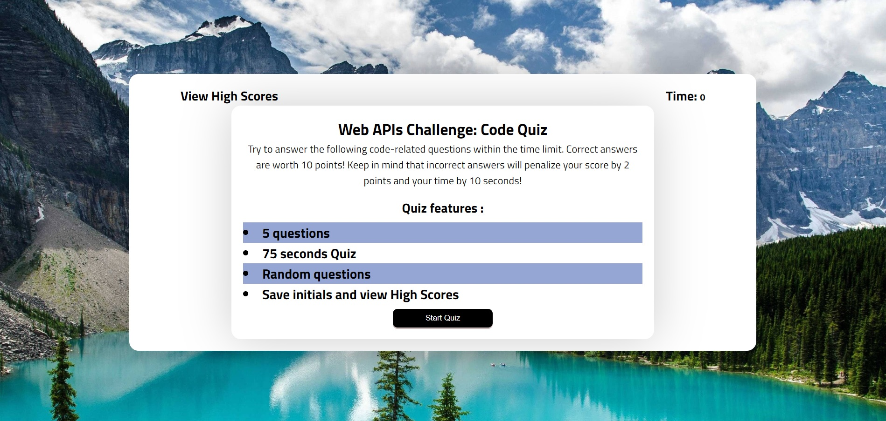
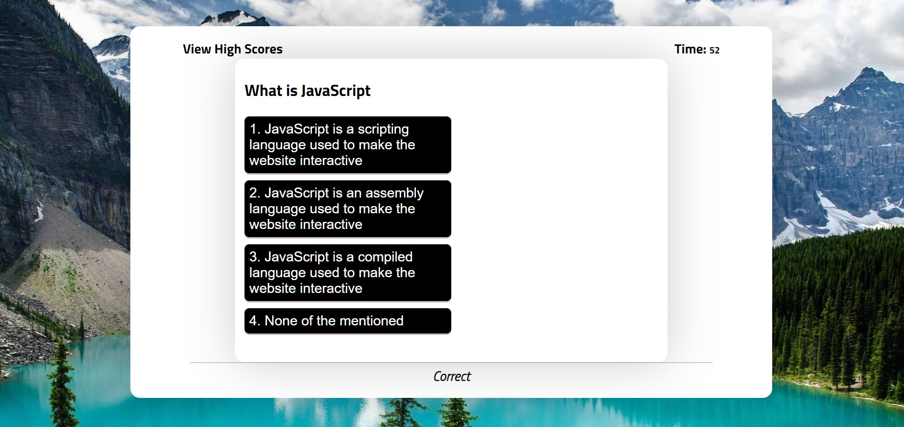
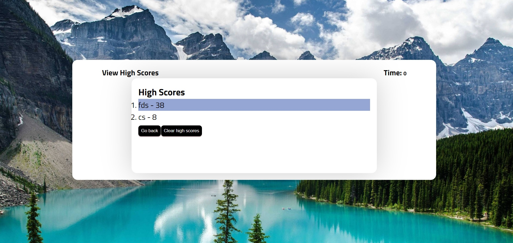

# Module4challenge - Web APIs Challenge: Code Quiz

## Criteria
1) WHEN I click the start button
2) THEN a timer starts and I am presented with a question
3) WHEN I answer a question
4) THEN I am presented with another question
5) WHEN I answer a question incorrectly
6) THEN time is subtracted from the clock
7) WHEN all questions are answered or the timer reaches 0
8) THEN the game is over
9) WHEN the game is over
10) THEN I can save my initials and my score

## Quiz features
1) 5 questions
2) 75 seconds Quiz
    a) time is subtracted from the clock if answer is incorrect.
3) Random questions
4) Save initials and scores.
5) View high scores on another page.

## Completed:
1) completed to generate start quiz button.
2) completed to generate time of 75 seconds.
3) completed to generate questions.
4) completed to presented with another question.
5) completed to add time subtract from the clock if answer incorrectly.
6) When users answers all questions or timer reaches 0 seconds, game is over.
7) created for the user to save initials and score. 
8) users can view high scores or clear it.

## Deployment
  URL: https://csetiawan88.github.io/quiz/

  GITHUB: https://github.com/csetiawan88/quiz

## Questions and answer source
https://www.sanfoundry.com/1000-javascript-questions-answers/

## Screen shot:




# 04 Web APIs: Code Quiz

## Your Task

At some point in your journey to become a full-stack web developer, you’ll likely be asked to complete a coding assessment&mdash;perhaps as part of an interview process. A typical coding assessment includes both multiple-choice questions and interactive coding challenges. 

To help familiarize you with these tests and allow you to use the skills covered in this module, this Challenge invites you to build a timed coding quiz with multiple-choice questions. This app will run in the browser and will feature dynamically updated HTML and CSS powered by JavaScript code that you write. It will have a clean, polished, and responsive user interface. 

This week’s coursework will equip you with all the skills you need to succeed in this assignment.

## User Story

```
AS A coding boot camp student
I WANT to take a timed quiz on JavaScript fundamentals that stores high scores
SO THAT I can gauge my progress compared to my peers
```

## Acceptance Criteria

```
GIVEN I am taking a code quiz
WHEN I click the start button
THEN a timer starts and I am presented with a question
WHEN I answer a question
THEN I am presented with another question
WHEN I answer a question incorrectly
THEN time is subtracted from the clock
WHEN all questions are answered or the timer reaches 0
THEN the game is over
WHEN the game is over
THEN I can save my initials and my score
```

## Mock-Up

The following animation demonstrates the application functionality:


## Grading Requirements

> **Note**: If a Challenge assignment submission is marked as “0”, it is considered incomplete and will not count towards your graduation requirements. Examples of incomplete submissions include the following:
>
> * A repository that has no code
>
> * A repository that includes a unique name but nothing else
>
> * A repository that includes only a README file but nothing else
>
> * A repository that only includes starter code

This Challenge is graded based on the following criteria: 

### Technical Acceptance Criteria: 40%

* Satisfies all of the preceding acceptance criteria.

### Deployment: 32%

* Application deployed at live URL.

* Application loads with no errors.

* Application GitHub URL submitted.

* GitHub repository contains application code.

### Application Quality: 15%

* Application user experience is intuitive and easy to navigate.

* Application user interface style is clean and polished.

* Application resembles the mock-up functionality provided in the Challenge instructions.

### Repository Quality: 13%

* Repository has a unique name.

* Repository follows best practices for file structure and naming conventions.

* Repository follows best practices for class/id naming conventions, indentation, quality comments, etc.

* Repository contains multiple descriptive commit messages.

* Repository contains quality readme file with description, screenshot, and link to deployed application.

## Review

You are required to submit BOTH of the following for review:

* The URL of the functional, deployed application.

* The URL of the GitHub repository, with a unique name and a readme describing the project.

---

© 2023 edX Boot Camps LLC. Confidential and Proprietary. All Rights Reserved.
